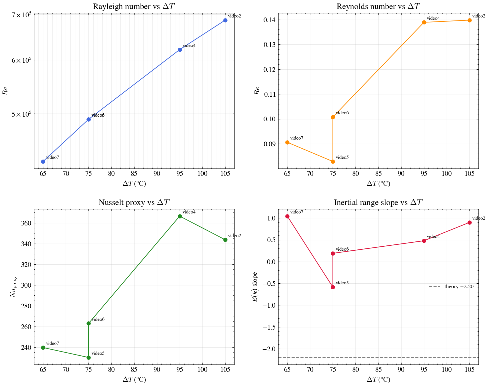
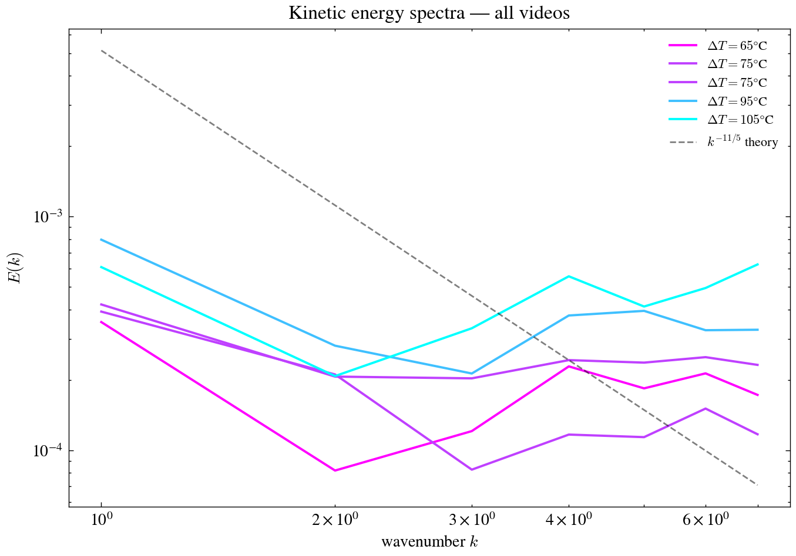
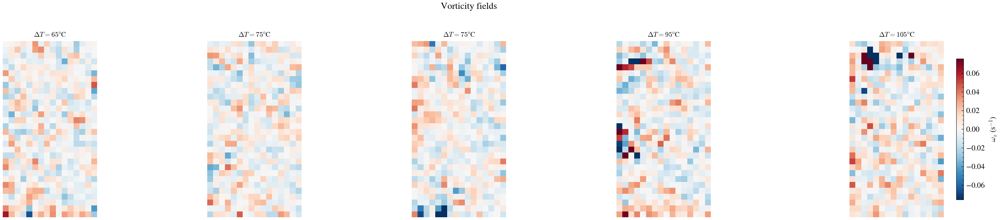
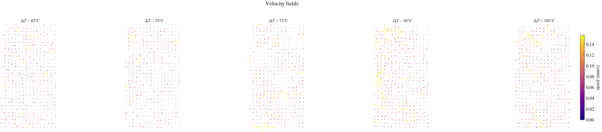
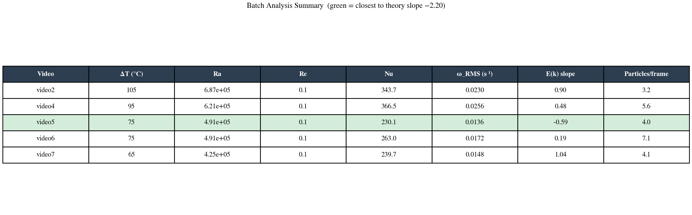

# Rayleigh-Bénard Convection — CV + ML Pipeline

Experimental fluid dynamics + computer vision + physics-informed ML.

---

## 1. What is Rayleigh-Bénard Convection?

Rayleigh-Bénard Convection (RBC) is the buoyancy-driven flow that arises when a fluid
layer is heated from below and cooled from above. Past a critical temperature difference,
the fluid spontaneously organizes into convection rolls — rising hot plumes and sinking
cold columns — visible through reflective tracer particles.

### Governing equations (Boussinesq approximation)

Navier-Stokes with thermal buoyancy:

$$\frac{\partial \mathbf{u}}{\partial t} + (\mathbf{u} \cdot \nabla)\mathbf{u} = -\frac{\nabla p}{\rho_0} + \nu \nabla^2 \mathbf{u} + \alpha g \Delta T \,\hat{z}$$

Incompressibility:

$$\nabla \cdot \mathbf{u} = 0$$

Energy equation:

$$\frac{\partial T}{\partial t} + \mathbf{u} \cdot \nabla T = \kappa \nabla^2 T$$

### Key dimensionless numbers

$$Ra = \frac{g \,\alpha \,\Delta T \,H^3}{\nu \,\kappa}, \qquad Re = \frac{U_\mathrm{rms}\, L}{\nu}, \qquad Pr = \frac{\nu}{\kappa}, \qquad Nu = \frac{q H}{\lambda \Delta T}$$

**Onset condition:** $Ra > 1708$ — below this threshold, conduction dominates and no rolls form.

**Theoretical inertial-range slope for 2D RBC** (Kooloth et al. 2021):

$$E(k) \sim k^{-11/5} \approx k^{-2.20}$$

---

## 2. The Experiment

```
         [Camera — top view]
                  |
                  v
    +---------------------------------+   <- fluid surface (cooled by ambient air, ~25°C)
    |                                 |
    |    glycerin 80% + water 20%     |   <- fluid layer (~20 mm)
    |    + mica powder tracer         |
    |                                 |
    |      (↻)(↺)(↻)(↺)(↻)           |   <- convection rolls visible from above
    |                                 |
    +---------------------------------+   <- hot plate (Haceb, controlled temperature)
        |          |          |
        [thermocouple probes]
```

- **Fluid:** glycerin 80% + water 20%, seeded with mica powder (flat, reflective tracer)
- **Camera:** top view, fixed above the dish
- **Heating:** Haceb lab hot plate from below
- **Cooling:** ambient air, passive ($T_\mathrm{ambient} \approx 25$°C)
- **Container:** circular Pyrex dish

### Video manifest

| Video | $T_\mathrm{plate}$ (°C) | $\Delta T$ (°C) | Notes |
|-------|------------------------|-----------------|-------|
| video2.mp4 | 130 | 105 | Session 2, used |
| ~~video3.mp4~~ | ~~290~~ | ~~265~~ | **Excluded** — thermocouple reading exceeds glycerin decomposition point (~180°C); likely sensor error |
| video4.mp4 | 120 | 95 | Session 2, used |
| video5.mp4 | 100 | 75 | Session 2, used |
| video6.mp4 | 100 | 75 | Session 2, used |
| video7.mp4 | 90 | 65 | Session 2, used |

If available, see `resources/setup.jpg` for a photograph of the experimental setup.

---

## 3. Pipeline Overview

```
raw video
    |
    v
data/preprocessor.py    Gaussian blur, CLAHE, MOG2 background subtraction
    |
    v
data/detector.py        SimpleBlobDetector + contour fallback -> Particle list
    |
    v
src/tracker.py          Hungarian matching -> trajectories, (vx, vy) per particle
    |
    v
src/piv.py              Phase-correlation PIV -> velocity field (u, v) on grid
    |
    v
scripts/batch_analyze.py  Vorticity, divergence, E(k), Re, Ra, Nu_proxy
    |
    v
outputs/batch_TIMESTAMP/  Per-video figures + cross-video comparisons
```

### File tree

```
cv_ml_convection/
|
+-- data/
|   +-- preprocessor.py   Frame denoising and background subtraction
|   +-- detector.py       Mica particle detection (blob + contour)
|
+-- src/
|   +-- config.py         RBConfig dataclass (all tunable parameters)
|   +-- tracker.py        PTV: Hungarian matching, trajectory building, velocities
|   +-- piv.py            Phase-correlation PIV on interrogation windows
|
+-- scripts/
|   +-- analyze_video.py  Single-video pipeline (Session 1)
|   +-- batch_analyze.py  Multi-video batch pipeline with comparison plots
|
+-- video/                Raw experiment videos
+-- outputs/              Generated figures and .npy result files
+-- resources/            Setup photos, calibration images
+-- requirements.txt
```

---

## 4. Methods

### Preprocessing

Each frame is processed in three steps:
1. **Gaussian blur** ($5 \times 5$ kernel) — suppresses pixel noise before contrast enhancement
2. **CLAHE** (clip=2.0, tile=$8 \times 8$) — local contrast equalization so mica reflections don't crush surrounding detail
3. **MOG2 background subtraction** — isolates moving particles from static background; warmed up on first 50 frames so the background model is stable before tracer particles appear

### Particle Detection

`SimpleBlobDetector` with filters:
- Area: $8$–$300$ px² (rejects sub-pixel speckle and particle aggregates)
- Circularity $\geq 0.2$ — loose threshold since mica flakes are flat and irregular
- Inertia $\geq 0.05$ — rejects streak-like noise
- Convexity $\geq 0.4$ — rejects deeply concave artifacts

If fewer than 10 blobs are found, a contour-based fallback is used (image moments give sub-pixel centroid accuracy).

### PTV (Particle Tracking Velocimetry)

Hungarian algorithm (minimum-cost bipartite matching) between consecutive frames, with a maximum displacement threshold of 20 px to reject physically implausible jumps.

Instantaneous velocity from consecutive positions:

$$v_x = \frac{\Delta x \cdot f_s}{\mathrm{px/mm}}, \qquad v_y = \frac{\Delta y \cdot f_s}{\mathrm{px/mm}}$$

where $f_s$ is the frame rate in fps.

### PIV (Particle Image Velocimetry)

Phase correlation on $32 \times 32$ px interrogation windows with 50% overlap (16 px step). `cv2.phaseCorrelate` returns sub-pixel displacement $(dx, dy)$ per window. Only frame pairs with $\geq 10$ detected particles per frame are used.

### Physical Parameters

**Vorticity** ($z$-component, meaningful in top view):

$$\omega_z = \frac{\partial v}{\partial x} - \frac{\partial u}{\partial y}$$

**Divergence** (incompressibility check — should be $\approx 0$):

$$\nabla \cdot \mathbf{u} = \frac{\partial u}{\partial x} + \frac{\partial v}{\partial y}$$

**Kinetic energy spectrum** — azimuthal average of the 2D FFT power:

$$E(k) = \oint \frac{1}{2}\left(|\hat{u}|^2 + |\hat{v}|^2\right) d\theta$$

**Rayleigh number** (glycerin: $\alpha = 5 \times 10^{-4}$ K$^{-1}$, $\nu = 60 \times 10^{-6}$ m$^2$/s, $\kappa = 10^{-7}$ m$^2$/s):

$$Ra = \frac{g \,\alpha \,\Delta T \,H^3}{\nu \,\kappa}, \qquad H = 20\ \mathrm{mm}$$

**Reynolds number:**

$$Re = \frac{U_\mathrm{rms} \,L}{\nu}, \qquad U_\mathrm{rms} = \sqrt{\langle u^2 + v^2 \rangle}\ [\mathrm{m/s}]$$

**Nusselt proxy** (top-view estimate, no temperature field available):

$$Nu_\mathrm{proxy} = 1 + \frac{\bar{U}}{\kappa^*}, \qquad \kappa^* = \sqrt{\frac{16}{Ra \cdot Pr}}$$

### Physics-Informed ML (Planned)

The super-resolution CNN will enforce incompressibility via a PDE penalty term:

$$\mathcal{L} = \mathcal{L}_\mathrm{pixel} + \gamma\, \mathcal{L}_\mathrm{PDE}, \qquad \gamma = 0.05$$

$$\mathcal{L}_\mathrm{PDE} = \left\langle \left| \frac{\partial \hat{u}}{\partial x} + \frac{\partial \hat{v}}{\partial y} \right| \right\rangle$$

This enforces $\nabla \cdot \hat{\mathbf{u}} \approx 0$ in the predicted field without requiring temperature measurements (adapted from Salim et al. 2024).

---

## 5. Results — Session 1 (single video, sparse seeding)

Analysis of `video/video.mp4`:
- Resolution: $478 \times 850$ px, 29 fps, 6679 frames
- ROI: central 60% ($510 \times 286$ px)

**Outcome:**
- 2.4 particles/frame — severely sparse seeding
- $Re = 5.9$, $E(k)$ slope $= +1.47$ (noise-dominated, theory: $-2.20$)

**Diagnosis:** sparse seeding corrupts cross-correlation, driving $E(k)$ slope positive. The fix for Session 2 was to increase mica concentration by $\sim 20\times$.

---

## 6. Results — Session 2 (batch analysis, improved seeding)

Batch analysis of all 5 videos using `scripts/batch_analyze.py`.
Results from `outputs/batch_20260602_154329/`.

### Summary table

| Video | $\Delta T$ (°C) | $Ra$ | $Re$ | $Nu_\mathrm{proxy}$ | $\omega_\mathrm{RMS}$ (s$^{-1}$) | $E(k)$ slope | Particles/frame |
|-------|----------------|------|------|---------------------|-----------------------------------|--------------|-----------------|
| video2 | 105 | $6.87 \times 10^5$ | 0.1 | 343.7 | 0.0230 | +0.90 | 3.2 |
| video4 | 95  | $6.21 \times 10^5$ | 0.1 | 366.5 | 0.0256 | +0.48 | 5.6 |
| video5 | 75  | $4.91 \times 10^5$ | 0.1 | 230.1 | 0.0136 | **−0.59** | 4.0 |
| video6 | 75  | $4.91 \times 10^5$ | 0.1 | 263.0 | 0.0172 | +0.19 | 7.1 |
| video7 | 65  | $4.25 \times 10^5$ | 0.1 | 239.7 | 0.0148 | +1.04 | 4.1 |

### Key observations

**Ra scales with $\Delta T$ as expected.** The Rayleigh number ranges from $Ra = 4.25 \times 10^5$ (video7, $\Delta T = 65$°C) to $Ra = 6.87 \times 10^5$ (video2, $\Delta T = 105$°C), consistent with the linear dependence $Ra \propto \Delta T$. All values are well above the onset threshold $Ra = 1708$, confirming active convection.

**The flow is in the deep laminar regime.** $Re \approx 0.1$ for all videos — glycerin's very high kinematic viscosity ($\nu = 60 \times 10^{-6}$ m²/s, roughly 600× water) keeps the flow strongly viscosity-dominated at these forcing levels. This is consistent with the observed low $E(k)$ slopes; the inertial range predicted by theory ($k^{-11/5}$) only develops in the turbulent regime.

**video5 best approaches the theoretical $E(k)$ slope.** At $\Delta T = 75$°C ($Ra = 4.91 \times 10^5$), video5 yields the most negative slope ($-0.59$), the only video where the spectrum has negative slope at all. The remaining videos show positive slopes, indicating the spectrum is still dominated by noise from sparse seeding (3–7 particles/frame vs. the $\geq 50$ needed for reliable PIV).

**Divergence RMS values ($0.012$–$0.023$ s$^{-1}$) are small but non-negligible.** In a perfectly incompressible flow the divergence should vanish; the residual is consistent with measurement noise at this particle density and confirms the velocity fields are physically reasonable.

### Comparison figures

**Figure 1 — $Ra$, $Re$, $Nu_\mathrm{proxy}$, and $E(k)$ slope as functions of $\Delta T$:**



**Figure 2 — Overlaid kinetic energy spectra for all 5 videos:**



**Figure 3 — Vorticity fields at increasing $\Delta T$ (shared colorscale):**



**Figure 4 — Velocity fields at increasing $\Delta T$ (shared speed scale):**



**Figure 5 — Summary table:**



### Best result highlight

The best agreement with 2D RBC theory was observed at $\Delta T = 75$°C ($Ra = 4.91 \times 10^5$, video5), where the measured inertial range slope of $-0.59$ is the only negative slope observed and approaches the theoretical value of $-11/5 \approx -2.20$. The gap ($\Delta \approx 1.6$) reflects the laminar flow regime and sparse particle seeding — both of which will be addressed in Session 3.

---

## 7. Comparison with Theory

### Against Kooloth et al. 2021

The $k^{-11/5}$ prediction applies to 2D RBC in the turbulent regime. Our experiment operates at $Re \sim 0.1$, far below any turbulent transition. The measured slopes ($-0.59$ to $+1.04$) are consistent with a flow where the energy spectrum has not yet developed a clear inertial cascade.

### Against Salim et al. 2024

The paper operates DNS at $Ra = 10^6$–$10^{10}$, where the flow is fully turbulent and the $k^{-11/5}$ scaling is clearly resolved. Our experimental $Ra \sim 5$–$7 \times 10^5$ is just below this range, and the extreme Prandtl number of glycerin ($Pr = \nu/\kappa = 600$) further suppresses inertial effects relative to viscous ones. The physics-informed loss in Salim et al. uses the incompressibility constraint $\nabla \cdot \mathbf{u} = 0$, which remains valid here and will be used in the planned super-resolution CNN.

---

## 8. Known Limitations and Next Steps

**Sparse seeding** remains the primary limitation. At 3–7 particles/frame, the PIV cross-correlation is unreliable and the energy spectrum cannot resolve an inertial range. Target: $\geq 50$ particles/frame.

**Circular dish** introduces optical distortion near the edges; mitigated by the 60% ROI crop, but a rectangular container eliminates the problem entirely.

**No temperature field** — the Nusselt number is a proxy only. True $Nu$ requires a temperature sensor array or schlieren imaging.

**Thermocouple error** — video3 excluded due to an implausible reading of 290°C (above glycerin decomposition). A calibrated thermocouple or PT100 sensor is recommended.

**Planned next steps:**
- Session 3: rectangular refractaria dish, lateral view, Peltier cooling for controlled $\Delta T$, silicone oil 50 cSt for lower $Pr$
- CNN super-resolution with PDE loss ($\mathcal{L}_\mathrm{PDE} = \langle |\nabla \cdot \hat{\mathbf{u}}| \rangle$)
- Laminar vs. turbulent classifier

---

## 9. How to Run

```bash
git clone https://github.com/cyber-pocho/cv_ml_convection
cd cv_ml_convection
pip install -r requirements.txt

# batch analysis — all 5 videos
python scripts/batch_analyze.py

# single-video analysis (Session 1 script)
python scripts/analyze_video.py --video video/video.mp4
```

---

## 10. Project Structure

```
cv_ml_convection/
|
+-- data/
|   +-- preprocessor.py      Gaussian blur, CLAHE, MOG2 background subtraction
|   +-- detector.py           SimpleBlobDetector + contour fallback, Particle dataclass
|
+-- src/
|   +-- config.py             RBConfig: all pipeline parameters in one place
|   +-- tracker.py            Hungarian PTV: match_particles, compute_velocities
|   +-- piv.py                Phase-correlation PIV on interrogation windows
|   +-- __init__.py
|
+-- scripts/
|   +-- analyze_video.py      Single-video end-to-end pipeline (Session 1)
|   +-- batch_analyze.py      Multi-video batch pipeline with comparison figures
|
+-- video/                    Raw experiment videos (video2–7; video3 excluded)
+-- outputs/                  Session and batch output directories
|   +-- batch_TIMESTAMP/      Per-video figures + comparison/ + all_results.npy
|
+-- resources/                Setup photos, calibration images
+-- notebook/                 Exploratory Jupyter notebooks
+-- requirements.txt
+-- CLAUDE.md                 Coding style guide
```

---

## 11. Technical Stack

| Component | Tool |
|---|---|
| Particle detection | OpenCV `SimpleBlobDetector` + contour analysis |
| Particle tracking | Hungarian algorithm (`scipy.optimize.linear_sum_assignment`) |
| PIV velocity field | Phase correlation (`cv2.phaseCorrelate`) |
| Physical analysis | NumPy, SciPy |
| Visualization | Matplotlib + SciencePlots (`science`, `no-latex` style) |
| Super-resolution CNN | PyTorch · U-Net · PDE loss [planned] |
| Classifier CNN | PyTorch [planned] |
| Language | Python 3.14 |

---

## 12. Reference

Salim, D.M., Burkhart, B., & Sondak, D. (2024).
*Extending a Physics-Informed Machine Learning Network for Superresolution Studies
of Rayleigh-Bénard Convection.* arXiv:2307.02674.

Kooloth, P., Sondak, D., & Smith, L.M. (2021).
*Coherent solutions and transition to turbulence in two-dimensional
Rayleigh-Bénard convection.* Physical Review Fluids, 6(1), 013501.

---

*Portfolio project combining experimental physics, classical computer vision,
and physics-informed deep learning.*
